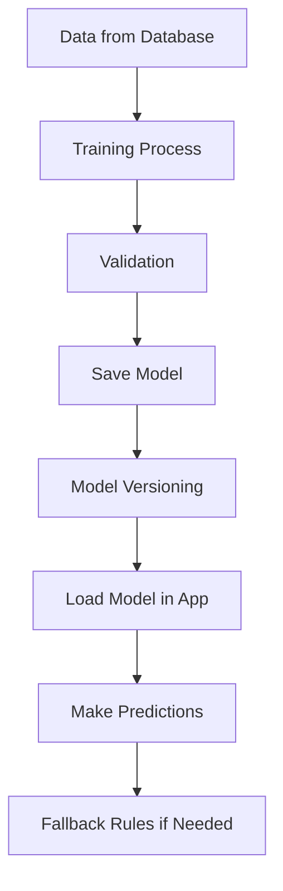
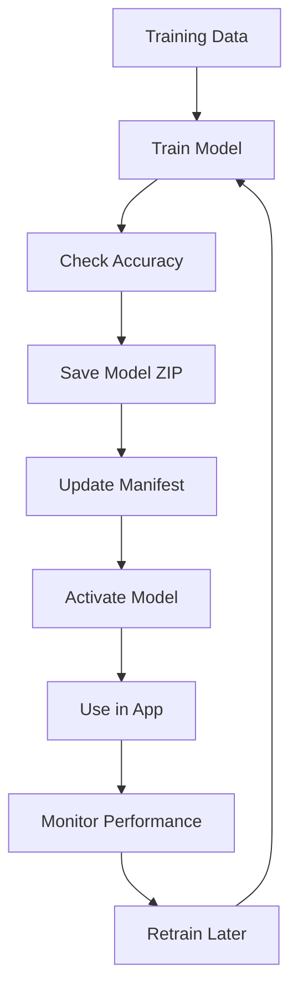

# 🤖 AI Services Architecture & Model Lifecycle (Beginner Guide)

## 📌 Overview

This project contains two AI services:

1. 🖥️ Hardware Recommendation System  
2. 🎫 Ticket Prioritization System  

Both systems automatically:

- Train AI models
- Save models safely
- Version models
- Load models at runtime
- Use fallback logic if AI is not available
- Retrain models automatically

👉 No manual AI deployment is required.

---

# 🧠 Simple Idea of the System

Think of it like this:

> The system learns from past data → creates a model → saves it → uses it → updates it automatically

---

# 🏗️ High-Level Architecture



---

# 🖥️ 1. Hardware Recommendation System

## 🎯 What it does

It recommends hardware based on:

- User role
- Service type
- Equipment type
- Past assignments
- Hardware name

---

## 🧪 How it learns

The AI learns from:

### 📊 Real Data
- Past hardware assignments in your system

### 🧠 Generated Data
- Rule-based examples (used when data is small)

---

## ⚙️ Model Type

| Feature | Value |
|--------|------|
| Type | Binary Classification |
| Algorithm | Logistic Regression |
| Framework | ML.NET |

---
## 🧩 Model Input & Output (Hardware Recommendation)

### ✅ Inputs (from API request + inventory features)
ML uses:
- `Role` (categorical)
- `Service` (categorical)
- `PreferredType` (categorical)
- `UsageLevel` (numeric, 1..5)
- `NeedsHighPerformance` (boolean -> numeric)
- `NeedsGraphics` (boolean -> numeric)

And it also enriches with inventory features:
- `MaterielType` (categorical)
- `MaterielName` (text)
- `StockQuantity` (numeric)
- `HealthScore` (numeric)
- `OpenTicketCount` (numeric)

### 🎯 Output (what the model produces)
The ML model predicts **Recommended vs Not Recommended** (binary classification) for each available materiel, then returns:

- `matchScore` (0..100 derived from model probability + bias rules)
- `reason` (includes `ml-score=...` and key feature signals)
- Top-N recommended hardware items

---

## 🧩 How features are used

### Categorical data

Example:
```
Role, Service, Equipment Type
```

👉 Converted using One-Hot Encoding

---

### Text data

Example:
```
Hardware name, description
```

👉 Converted using Text Featurization

---

## 🔄 Pipeline (Simple View)


---

## ⚠️ Fallback System

If AI is not ready:

👉 The system uses rule-based logic instead of ML

So it never breaks.

---

# 🎫 2. Ticket Prioritization System

## 🎯 What it does

It classifies tickets into:

- Critique (Critical)
- Haute (High)
- Moyenne (Medium)
- Faible (Low)

---

## 🧪 How it learns

Uses:

### 📊 Ticket history
- Past support tickets

### 🏷️ Labeled examples
- Manually prepared training data

---

## ⚙️ Model Type

| Feature | Value |
|--------|------|
| Type | Multiclass Classification |
| Algorithm | SDCA Maximum Entropy |
| Framework | ML.NET |

---

## 🧩 Features used

### Text features
```
Title, Description, Category, Equipment
```

### Numeric features
```
Urgency, Impacted Users, Criticality
```

---

## 🔄 Pipeline


---

## ⚠️ Fallback System

If model is not available:

```
Priority Score =
Severity keywords
+ Urgency
+ Impact
+ Criticality
```

---

# 💾 Model Saving (VERY IMPORTANT)

## 🧠 Key Idea

👉 Models are automatically saved after training  
👉 No manual export is needed  

---

## 📦 What gets saved?

Each model is saved as:

```
model_YYYYMMDDHHMMSS.zip
```

Example:
```
model_20260613143022.zip
```

---

## 📁 Storage structure

```
ml-models/
│
├── hardware-recommendation/
│   ├── manifest.json
│   ├── model_1.zip
│   ├── model_2.zip
│
└── ticket-prioritization/
    ├── manifest.json
    ├── model_1.zip
```

---

## 📦 What is inside the .zip model?

The `.zip` contains:

- AI model weights
- Feature preprocessing steps
- Data schema
- Full pipeline

👉 It is a complete AI package

---

# 🔁 Model Lifecycle (Simple Explanation)



---

# 📄 Model Manifest (Brain of the System)

Each AI service has a file:

```
manifest.json
```

It stores:

```json
{
  "ActiveVersion": "20260613143022",
  "PreviousVersion": "20260613135500",
  "ValidationMetric": 0.92,
  "LastTrainedUtc": "2026-06-13"
}
```

---

## 🧠 Why manifest is important?

It helps the system:

- Know which model is active
- Rollback if needed
- Track performance
- Load correct version

---

# 🚀 Runtime Behavior (How AI works in production)

## Step 1: App starts
- Loads manifest
- Finds latest model

## Step 2: Prediction request comes
- If model exists → use ML
- If not → use fallback rules

## Step 3: Safety system
- If model fails → switch to previous version

---

# 🔄 Automatic Retraining

The system:

- Collects new data
- Trains new model
- Validates accuracy
- Replaces old model if better

👉 Fully automatic background process

---

# ⚖️ ML.NET vs Classic AI (Easy Comparison)

## 🟦 ML.NET (Your system)

- Everything inside .NET
- Model saved as `.zip`
- Includes preprocessing + model
- Easy deployment
- No external server needed

---

## 🟧 TensorFlow / PyTorch

- Uses Python
- Model formats:
  - `.h5` (TensorFlow)
  - `.pt` (PyTorch)
- Requires separate inference service
- More flexible but more complex

---

## 🧠 Key Difference

| Feature | ML.NET | TensorFlow |
|--------|--------|------------|
| Model file | `.zip` | `.h5 / .pt` |
| Preprocessing included | Yes | No |
| Deployment | Simple | Complex |
| Language | C# | Python |

---

# 🛡️ Safety & Reliability

The system is designed to NEVER fail:

- ✔ Fallback rules always exist
- ✔ Previous model is saved
- ✔ Automatic rollback works
- ✔ Models are versioned
- ✔ No manual intervention needed

---

# 📊 Key Benefits

## ✔ Reliability
- System always returns a result

## ✔ Automation
- Training + saving + loading is automatic

## ✔ Scalability
- Works with more data over time

## ✔ Maintainability
- Easy version tracking

## ✔ Reproducibility
- Every model can be restored

---

# 🧾 Final Summary

This project is a **fully automated AI system** built with ML.NET that:

- Learns from real data
- Automatically trains models
- Saves them as versioned `.zip` files
- Loads them at runtime
- Uses fallback rules when needed
- Retrains automatically in background

👉 It is a production-ready machine learning pipeline with zero manual deployment effort.

---