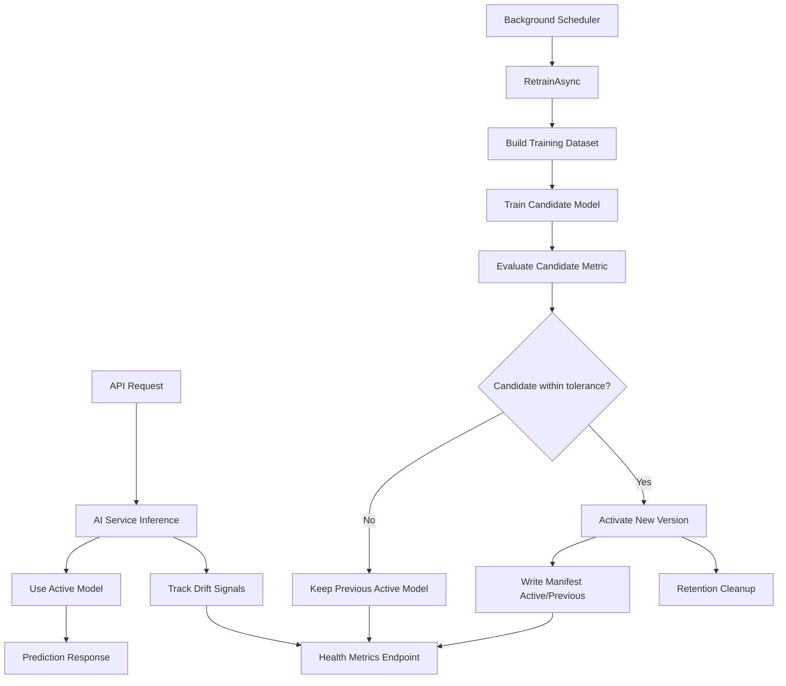
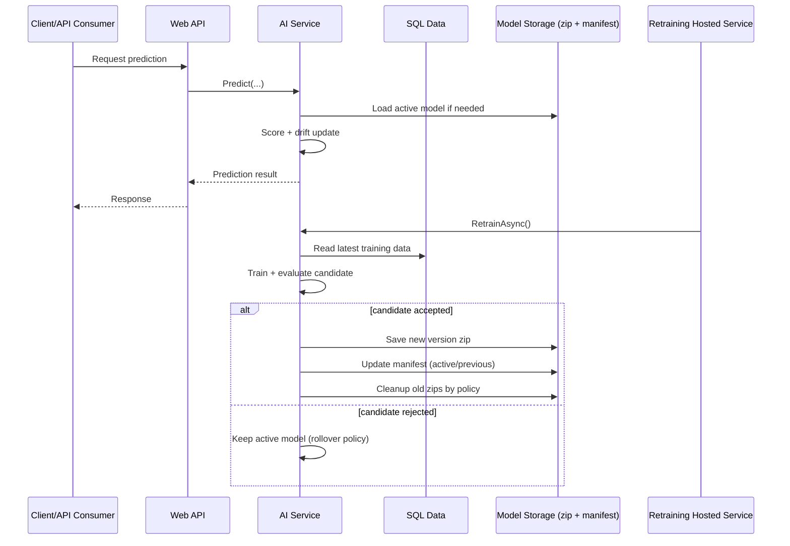

# AI Phase 3 Implementation Report

## Scope Completed

This report documents the full set of AI Phase 3 changes implemented to harden model operations while preserving existing API contracts for frontend and integration stability.

### Goals Covered

1. Explicit model version metadata and controlled model rollover.
2. Controlled retraining schedule with a background hosted service.
3. Metrics endpoint for model freshness, last training time, and drift indicators.
4. Lightweight integration test for metrics response shape.
5. Production-tuned retraining cadence and thresholds.
6. Retention cleanup policy for versioned model artifacts.

## Architecture and Contract Stability

All external API contracts remain stable. Existing recommendation and ticket-priority endpoints were not replaced; AI lifecycle enhancements were added behind the same service abstractions.

## AI Models Used (Exact)

### Hardware recommendation model

Model type:
- ML.NET binary classification

Trainer:
- LbfgsLogisticRegression

Pipeline summary:
1. One-hot encoding for role, service, preferred type, and materiel type.
2. Text featurization for materiel name.
3. Feature concatenation with request and inventory signals:
   - usage level
   - high-performance need flag
   - graphics need flag
   - stock quantity
   - health score
   - open ticket count
4. Binary training for recommendation probability.

Primary output:
- Probability score that a specific hardware item matches the request profile.

### Ticket prioritization model

Model type:
- ML.NET multiclass classification

Trainer:
- SdcaMaximumEntropy

Pipeline summary:
1. Label mapping to key for multiclass target.
2. Text featurization for title and description.
3. Text featurization for category and equipment type.
4. Feature concatenation with operational signals:
   - urgency level
   - impacted users
   - equipment criticality
5. Multiclass training for predicted priority class.

Primary output:
- Predicted priority label (e.g., basse, moyenne, haute, critique), later transformed into business severity score.

## Full Approach and Mechanism

The implementation follows one unified operational mechanism for both models:

1. Service startup attempts to load active model from manifest.
2. If no valid active model exists, service can use previous model path fallback.
3. Incoming inference requests are served with the active model and update drift trackers.
4. Background scheduler triggers periodic retraining using fresh database data.
5. Candidate model is trained and evaluated.
6. Candidate activation decision is made with configurable metric tolerance.
7. If accepted, candidate becomes active; previous active is preserved for rollback.
8. Versioned artifact and manifest are updated atomically.
9. Retention cleanup removes old model zips while preserving active and previous versions.
10. Health metrics endpoint exposes model freshness, status, and drift for monitoring.

### End-to-end flow diagram

### Data and model lifecycle diagram

### Operational safety mechanisms

1. Metric tolerance gate prevents weak candidates from replacing active model.
2. Previous version metadata provides quick fallback path.
3. Retention keeps storage bounded and preserves rollback capability.
4. Drift score supports early detection of behavior/data distribution changes.
5. Health endpoint centralizes AI operational visibility.

## Main Changes Implemented

### 1) AI Model Status DTOs and Service Contract Extensions

Added unified model telemetry DTOs:
- src/ITStockM.Application/Common/Models/AiModelMetricsDtos.cs

Extended AI service interfaces with lifecycle operations:
- src/ITStockM.Application/Common/Interfaces/IHardwareRecommendationService.cs
- src/ITStockM.Application/Common/Interfaces/ITicketPrioritizationService.cs

New methods:
- RetrainAsync
- GetModelStatusAsync

### 2) Hardware Recommendation Service Hardening

File:
- src/ITStockM.Infrastructure/Services/HardwareRecommendationService.cs

Implemented:
1. Versioned model persistence using timestamped zip artifacts.
2. Manifest-based active/previous model metadata.
3. Activation decision with metric tolerance.
4. Rollover behavior to previous model when activation candidate is not acceptable.
5. Drift tracking from live request signals.
6. Safe evaluation fallback for tiny or imbalanced split data.
7. Retention cleanup to prune old model artifacts while preserving active/previous versions.

### 3) Ticket Prioritization Service Hardening

File:
- src/ITStockM.Infrastructure/Services/TicketPrioritizationService.cs

Implemented:
1. Versioned model persistence and manifest metadata.
2. Activation decision with tolerance.
3. Rollover behavior to previous model.
4. Drift tracking from ticket request signals.
5. Retention cleanup for old model artifacts.

### 4) Scheduled Retraining Background Service

Added files:
- src/ITStockM.Infrastructure/Services/AiModelRetrainingOptions.cs
- src/ITStockM.Infrastructure/Services/AiModelRetrainingBackgroundService.cs

Wired in DI:
- src/ITStockM.Infrastructure/DependencyInjection/InfrastructureLayerServiceCollectionExtensions.cs

Behavior:
1. Config-driven enable/disable.
2. Config-driven initial delay and retraining interval.
3. Executes RetrainAsync for both AI services in each cycle.
4. Logs success/failure per cycle.

### 5) AI Metrics Endpoint

Extended controller:
- src/ITStockM.WebApi/Controllers/HealthController.cs

Endpoint:
- GET /api/v1/health/ai-models

Response includes:
1. Generated timestamp.
2. Model list with:
   - model name
   - active and previous version
   - last trained time
   - interval minutes
   - sample count
   - validation metric
   - drift score and drift level
   - last retrain status
   - active model path
3. Fleet-level max drift score and fleet drift level.

### 6) Configuration Tuning for Cadence and Thresholds

Updated:
- src/ITStockM.WebApi/appsettings.json
- src/ITStockM.WebApi/appsettings.Development.json

Added section:
- AiModels:Retraining

Includes:
1. Enabled
2. InitialDelayMinutes
3. IntervalMinutes
4. MinimumHardwareTrainingSamples
5. MinimumTicketTrainingSamples
6. ActivationMetricTolerance
7. MaxModelVersionsToKeep
8. DriftMediumThreshold
9. DriftHighThreshold

### 7) Lightweight Integration Test for Response Shape

Added test:
- src/ITStockM.Tests/Api/HealthControllerIntegrationTests.cs

Coverage:
1. Calls health AI metrics action.
2. Validates top-level response shape.
3. Validates per-model property shape in serialized JSON.
4. Verifies fleet aggregation semantics.

## Validation Performed

Focused tests run:
- HealthControllerIntegrationTests
- HardwareRecommendationServiceTests
- TicketPrioritizationServiceTests

Observed result:
- Passed: 4
- Failed: 0

## Notes on Existing Warnings

Repository-level warnings remain (nullable annotations, package advisories, platform analyzer warnings). These were pre-existing and non-blocking for the delivered Phase 3 scope.

## Outcome

AI capabilities are now production-hardened with:
1. Observable model lifecycle metadata.
2. Controlled retraining operations.
3. Drift visibility at model and fleet levels.
4. Stable contract compatibility for current frontend and integrations.
5. Automated cleanup to prevent unbounded artifact growth.
